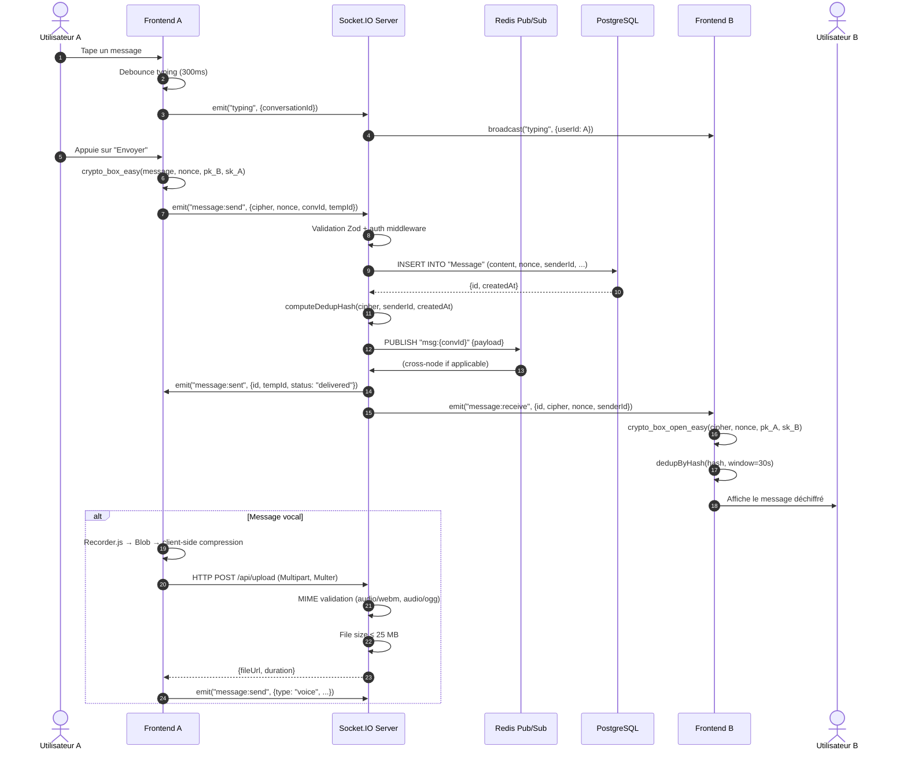

# Architecture du Système

> Vue d'ensemble complète de l'architecture de la messagerie temps réel. C4 Model niveaux 1 à 3, topologie réseau, flux de données et décisions architecturales.

---

## Table des matières

1. [Contexte système (C4 Level 1)](#1-contexte-système-c4-level-1)
2. [Conteneurs (C4 Level 2)](#2-conteneurs-c4-level-2)
3. [Composants backend (C4 Level 3)](#3-composants-backend-c4-level-3)
4. [Topologie réseau](#4-topologie-réseau)
5. [Flux de données critiques](#5-flux-de-données-critiques)
6. [Décisions architecturales (ADRs)](#6-décisions-architecturales-adrs)
7. [Diagramme de séquence — Envoi d'un message](#7-diagramme-de-séquence--envoi-dun-message)

---

## 1. Contexte système (C4 Level 1)

```
┌─────────────────┐      WebSocket / HTTPS       ┌─────────────────────────────┐
│   Utilisateur   │◄────────────────────────────►│  Real-Time Messenger        │
│  (Browser / PWA)│                              │  (Next.js + Node.js)        │
└─────────────────┘                              └─────────────────────────────┘
                                                          │
                                                          │ SQL / Redis
                                                          ▼
                                                 ┌─────────────────┐
                                                 │ PostgreSQL +    │
                                                 │ Redis + AI      │
                                                 │ Services        │
                                                 └─────────────────┘
```

**Acteurs :**
- **Utilisateur** : envoie des messages texte, vocaux, fichiers. Active le 2FA, consulte les résumés IA.
- **Système** : détecte le spam, résume les conversations, traduit les messages.

---

## 2. Conteneurs (C4 Level 2)

```
┌─────────────────────────────────────────────────────────────────────────────┐
│                              Hébergeur (VPS / K8s)                          │
│  ┌──────────────┐  ┌──────────────┐  ┌──────────────┐  ┌─────────────────┐  │
│  │   Next.js    │  │  Node.js     │  │   Redis      │  │  PostgreSQL     │  │
│  │  (Frontend)  │  │  (Socket.IO  │  │  (Pub/Sub,   │  │  (Prisma ORM,   │  │
│  │  App Router  │  │   Server)    │  │  Sessions)   │  │  GIN FTS)       │  │
│  └──────────────┘  └──────────────┘  └──────────────┘  └─────────────────┘  │
│         │                 │                                               │   │
│  ┌──────────────┐  ┌──────────────┐                              ┌─────────┘   │
│  │   llama.cpp  │  │ LibreTrans-  │                              │  AI Local │
│  │   (Résumés)  │  │   late       │                              │  (CPU)    │
│  └──────────────┘  └──────────────┘                              └───────────┘
└─────────────────────────────────────────────────────────────────────────────┘
```

| Conteneur | Rôle | Port | Tech |
|-----------|------|------|------|
| `web` | Serveur Next.js (SSR / RSC) | 3000 | Next.js 15, React 19 |
| `api` | Serveur Socket.IO + REST | 4000 | Node.js 22, Socket.IO 4 |
| `redis` | Sessions, pub/sub, rate limiting | 6379 | Redis 7 |
| `postgres` | Persistance relationnelle | 5432 | PostgreSQL 16 |
| `llama` | Résumés de conversations | 8080 | llama.cpp (GGUF Q4) |
| `libretranslate` | Traduction self-hosted | 5000 | LibreTranslate |

---

## 3. Composants backend (C4 Level 3)

Le backend suit une architecture **hexagonale / onion** avec 3 couches strictes :

```
┌─────────────────────────────────────────┐
│           Transport Layer               │  ← Socket.IO handlers, REST controllers
│  (socket-handlers/, middleware/)        │
├─────────────────────────────────────────┤
│            Domain Layer                 │  ← Services métier, règles, DDD
│  (services/, entities/, dto/)           │
├─────────────────────────────────────────┤
│         Persistence Layer               │  ← Prisma, Redis adapters
│  (repositories/, prisma/)               │
└─────────────────────────────────────────┘
```

### Règles de dépendance

```typescript
// Règle : une couche interne ne connaît JAMAIS une couche externe.
// Valide : Domain -> Persistence (via interface)
// Invalide : Transport -> Persistence (direct)

// @/domain/services/MessageService.ts
interface IMessageRepository {
  create(dto: CreateMessageDto): Promise<Message>;
  findByConversation(convId: string, cursor?: string, limit: number): Promise<Paginated<Message>>;
}

export class MessageService {
  constructor(private readonly repo: IMessageRepository) {}
  // ... logique métier pure
}
```

---

## 4. Topologie réseau

### Mode single-node (développement)

```
Browser ──► Next.js (3000) ──► API Routes (internal) ──► Socket.IO (4000)
                                    │
                                    ▼
                              PostgreSQL + Redis (localhost)
```

### Mode production (horizontal scaling)

```
                        ┌─────────────┐
                        │   Nginx     │
                        │  (LB/SSL)   │
                        └──────┬──────┘
                               │
              ┌────────────────┼────────────────┐
              ▼                ▼                ▼
        ┌──────────┐     ┌──────────┐     ┌──────────┐
        │  Web-1   │     │  Web-2   │     │  Web-N   │
        │ (Next.js)│     │ (Next.js)│     │ (Next.js)│
        └────┬─────┘     └────┬─────┘     └────┬─────┘
             │                │                │
             └────────────────┼────────────────┘
                              ▼
                        ┌──────────┐
                        │  API-1   │◄────┐
                        │(Socket.IO│     │ Redis Pub/Sub
                        └──────────┘     │ (état partagé)
                        ┌──────────┐     │
                        │  API-2   │◄────┘
                        │(Socket.IO│
                        └──────────┘
                              │
                              ▼
                        ┌──────────┐
                        │PostgreSQL│
                        │  + GIN   │
                        └──────────┘
```

**Pourquoi Redis Pub/Sub ?** Quand `API-1` et `API-2` sont sur des instances différentes, un utilisateur connecté à `API-1` ne reçoit pas les messages émis par `API-2`. Redis assure la diffusion cross-node.

---

## 5. Flux de données critiques

### 5.1 Authentification + 2FA

```
Browser ──► NextAuth JWT ──► Credentials provider
                               │
                               ├──► Vérification mot de passe (argon2)
                               │
                               └──► 2FA TOTP requis ? ──► Speakeasy.verify()
                                                              │
                                                              ▼
                                                    Session Redis (ttl=24h)
                                                              │
                                                              ▼
                                                    Cookie `__session` (httpOnly, secure, SameSite)
```

### 5.2 Envoi d'un message (E2E)

```
Browser-A                     API (Node.js)                    Browser-B
   │                              │                                │
   │  1. DH key exchange          │                                │
   │◄────────────────────────────►│                                │
   │  (libsodium.box_keypair)     │                                │
   │                              │                                │
   │  2. Chiffre msg avec clé DH  │                                │
   │  3. POST /api/messages       │                                │
   │─────────────────────────────►│                                │
   │                              │  4. Persiste (Prisma)          │
   │                              │     + Génère hash (dedup)      │
   │                              │                                │
   │                              │  5. Publie sur Redis pub/sub   │
   │                              │                                │
   │                              │  6. Émet Socket.IO            │
   │                              │───────────────────────────────►│
   │                              │                                │
   │                              │                                │ 7. Déchiffre (libsodium)
   │                              │                                │ 8. Déduplique (hash + window)
   │                              │                                │ 9. Affiche
```

### 5.3 Recherche Full-Text

```
Browser ──► Query : "projet urgent"
                │
                ▼
        Prisma.$queryRaw`
          SELECT * FROM "Message"
          WHERE to_tsvector('french', content) @@ plainto_tsquery('french', ${query})
          ORDER BY ts_rank(to_tsvector('french', content), plainto_tsquery('french', ${query})) DESC
          LIMIT 20 OFFSET ${offset}
        `
                │
                ▼
        Résultats + highlighting (ts_headline)
```

---

## 6. Décisions architecturales (ADRs)

### ADR-001 : Socket.IO au lieu de WebSocket natif

- **Contexte** : besoin de fallback pour réseaux restrictifs, rooms intégrées, reconnexion automatique.
- **Décision** : Socket.IO 4.x avec transport `websocket` préféré, `polling` en fallback.
- **Conséquences** : dépendance au protocole Socket.IO, incompatible avec client WS natif. Gain : robustesse réseau.

### ADR-002 : Chiffrement E2E côté client uniquement

- **Contexte** : conformité RGPD, confidentialité des contenus.
- **Décision** : libsodium.js dans le navigateur. Le serveur ne voit que des ciphertexts (base64).
- **Conséquences**** : impossible de faire de la recherche côté serveur sur le contenu chiffré. Contournement : indexation des métadonnées (expéditeur, timestamp, conversation).

### ADR-003 : IA locale (CPU) plutôt que SaaS

- **Contexte** : coût, confidentialité, offline-first.
- **Décision** : llama.cpp Q4_0 (≈ 4 GB RAM), LibreTranslate self-hosted, fastText offline.
- **Conséquences**** : qualité inférieure à GPT-4 pour les résumés, mais zero egress cost et zero data leak.

### ADR-004 : Pagination cursor-based pour l'historique

- **Contexte** : OFFSET/LIMIT dégrade en O(n) sur de grands volumes.
- **Décision** : `cursor = `${timestamp}::${id}`` encodé en base64url.
- **Conséquences** : O(log n) grâce à l'index composite `(conversationId, createdAt DESC, id)`.

---

## 7. Diagramme de séquence — Envoi d'un message



---

## Glossaire

| Terme | Définition |
|-------|------------|
| **Ciphertext** | Message chiffré, illisible sans la clé privée |
| **Cursor** | Pointeur opaque pour la pagination, encode `(timestamp, id)` |
| **DH** | Diffie-Hellman — protocole d'échange de clés |
| **GIN** | Generalized Inverted Index — index PostgreSQL optimisé pour `tsvector` |
| **Pub/Sub** | Pattern publish/subscribe pour la diffusion d'événements |
| **TOTP** | Time-based One-Time Password (RFC 6238) |
